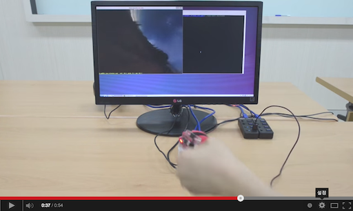
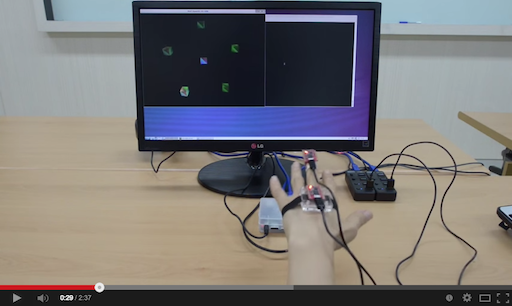
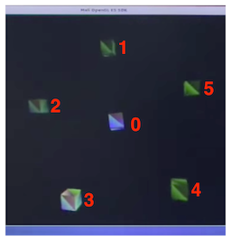

# myAHRS+ examples with OpenGL ES 

These examples show you how to use the myAHRS+ with opengl on your odroid xu3. 

## How to build 

Install compiler and subversion client on your odroid.

```
$ sudo apt-get update
$ sudo apt-get install subversion build-essential
```

Download source tree from github. 

```
$ cd YOUR_WORKING_DIRECTORY
$ svn export https://github.com/myahrsplus/myahrs_plus_examples/trunk/odroid_xu3
```

Build all examples.

```
$ cd odroid_xu3/opengles30
$ ./config.sh; make -j8
```


## Details of examples  

It is assumed that your myAHRS+ is connected to /dev/ttyACM0.  

### Cube 

[](http://youtu.be/kSFM3_NDcoQ)

This is the simplest example displays the cube that rotates along with the movement of the myAHRS+. 
You can run this example as follows.

```
$ ./samples/opengles_20/cube_with_myahrs/cube_myahrs /dev/ttyACM0
```

### SkyBox 
[](http://youtu.be/kSFM3_NDcoQ)

This is a simple head tracking example. You can run this example as follows.

```
$ ./samples/opengles_30/skybox_with_myahrs/skybox_myahrs /dev/ttyACM0
```

### Instancing  

[](http://youtu.be/tJZoBz_R7Vg)

This is a simple motion capture example. Each cube moves along with the movement of the sensor attached to your finger or back of the hand. In order to distinguish the respective sensors, a unique ID should be granted for each sensor. With the myAHRS+ monitor, you can change the sensor id of myAHRS+. 

Sensor IDs were assigned as fallows.



If you want to play this example with single sensor, run this example as follows.

```
$ ./samples/opengles_30/instancing_with_myahrs/instancing_myahrs /dev/ttyACM0
```

If you have more than one myAHRS+, run this example as follows.

```
$ ./samples/opengles_30/instancing_with_myahrs/instancing_myahrs /dev/ttyACM0 /dev/ttyACM1 … /dev/ttyACMN
```

