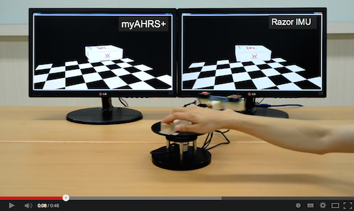
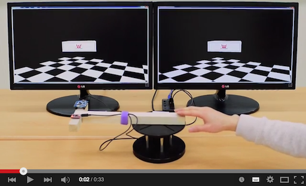
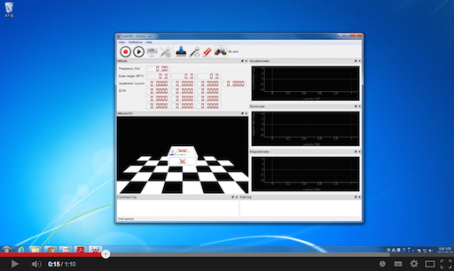
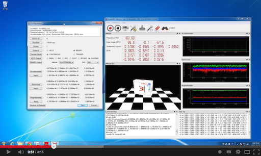
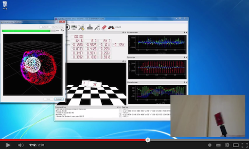

# Introduction

The myAHRS+ is a low cost high performance AHRS(Attitude Heading Reference System). 
Its attitude output is more stable to acceleration and magnetic disturbances then other low cost AHRS/IMU products. 
Communication and configuration are enabled via UART/USB interface for user applications. And I2C interface is available for embedded application like arduino projects.
The GUI(myAHRS+ Monitor) is available, which allows users configure all myAHRS+  settings, view attitude of myAHRS+ and IMU(Inertial Measurement Unit) data in realtime and save sensor data in a text file. Custom user software may be developed using the myAHRS+ SDK.

## Features

* Sensors
  * Triple axis 16-bit gyroscope : ± 2,000 dps
  * Triple axis 16-bit accelerometer : ± 16 g
  * Triple axis 13-bit magnetometer  : ± 1200 μT
* On board software
  * Exteneded Kalman filter
  * max 100 Hz output rate
    * Attitude : Euler angle, Quaternion
    * sensor : acceleration, rotation rate, magnetic field
* Connectivity
  * USB : Virtual COM PORT
  * UART : Standard baud rates up to 460800 bps
  * I2C : up to 1kHz
* GUI(myAHRS+ Monitor)
  * display attitude and sensor data from myAHRS+ on various viewers
  * Configuration
  * magnetometer calibration

## Performance

Performance comparison between myAHRS+ and Razor 9 axis IMU.

Performance comparison between myAHRS+ and MPU9150 MotionFit.

## Pin map

Pin | Name | Type | Description
------|------|------|-------------
J3-1 | INT | O | DATA READY interrupt output
J3-2 | SLEEP | I | Sleep mode selection input: L-sleep mode, H-normal mode. (Normal mode If not connected)
J3-3 | I2C_SCL | I | I2C clock input 
J3-4 | I2C_SDA |  I/O  | I2C data input and output 
J3-5 | USB_DM | I/O | USB D-
J3-6 | USB_DP | I/O | USB D+
J3-7 | NC |   | Do Not Connect
J3-8 | NC |   | Do Not Connect
J3-9 | NC |   | Do Not Connect
J3-10 | NC |   | Do Not Connect
J4-1 | VDD | PWR | +5V power input 
J4-2 | nRST | I | Reset input. L-reset, H-normal
J4-3 | NC |  | Do Not Connect
J4-4 | UART_TX | O | UART transmit
J4-5 | UART_RX | I | UART receive
J4-6 | NC |  | Do Not Connect
J4-7 | NC |  | Do Not Connect
J4-8 | NC |   | Do Not Connect    
J4-9 | NC |   | Do Not Connect    
J4-10| GND | PWR | Power ground. 0V

# Testing the myAHRS+

First, connect myAHRS+ to your PC via USB. And then, check LEDs on myAHRS+. The blinking yellow LED means that myAHRS+ is in normal state. And the red one means that myAHRS+ is connected to PC via USB successfuly. 

The following video shows the tesing procedure of myAHRS+ using GUI(myAHRS+ Monitor). 

# Configuration

Using the myAHRS+ Monitor, user can change various properties of myAHRS+ for user application. 
Some properties are saved in non-volatile memory(flash memory), but others are not. Therefore, the volatile properties should be re-initialized to appropriate values when the user application starts.  

* Non-volatile properties
 * Sensor ID
 * Baudrate of UART interface
 * Sensor calibration parameters
* Volatile properties
 * Divider
 * Protocol
 * Transfer mode
 * ASCII output format
 * BINARY output format
 
To update the myAHRS+ settings(properties), run myAHRS+ Monitor. And then open the 'Configuration' dialog window.

This video shows the setting procedure of myAHRS+ using myAHRS+ Monitor. 

# Calibration

The magnetometer(compass) used to estimate yaw angle of AHRS. To get better measurment of yaw angle, the magnetometer of myAHRS+ should be calibrated by the user at the very place where it'll be used. The following description explains why to do so.

Measurement of magnetic field will be subjected to distortion. There are two categories of these distortions: the hard iron distortions and the soft iron distortions. The hard iron errors refer to the presence of magnetic fields around the sensor  such as magnets, power supply wires are related to the measurement offset errors, while the soft iron errors refer to the presence of the ferromagnetic materials around the sensor which skew the density of the Earth's magnetic field locally, are related to the scaling offset errors. (http://diydrones.com/profiles/blogs/advanced-hard-and-soft-iron-magnetometer-calibration-for-dummies)

This video shows the calibration procedure of myAHRS+ using myAHRS+ Monitor.

# Examples

Some useful examples for using the myAHRS+ are available for various platforms.

* [myAHRS+ SDK](../common_cpp).
* [python](../common_python).
* [odroid XU3](../odroid_xu3).
* [odroid C1](../odroid_c1).

